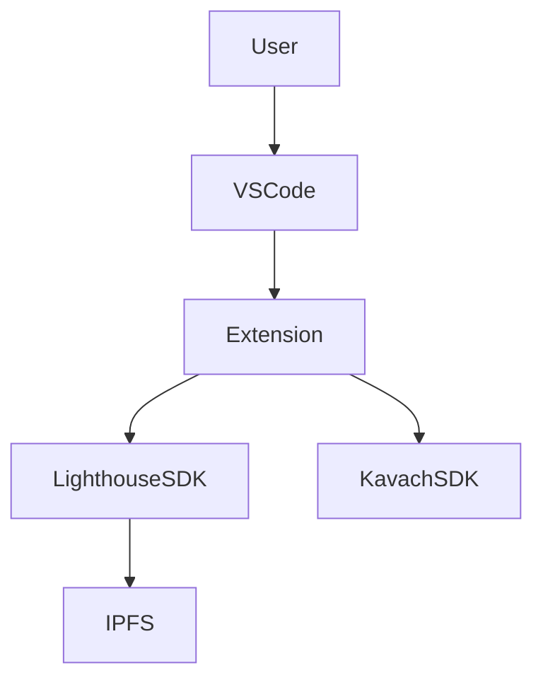

# Lighthouse IDE Extension - Architecture Documentation

## Table of Contents

1. [Overview](#overview)
2. [System Architecture](#system-architecture)
3. [Component Design](#component-design)
4. [Data Models](#data-models)
5. [API Interfaces](#api-interfaces)
6. [Security Architecture](#security-architecture)
7. [Performance Considerations](#performance-considerations)
8. [Development Guidelines](#development-guidelines)
9. [Deployment Strategy](#deployment-strategy)

## Overview

The Lighthouse VSCode Extension bridges the gap between traditional development workflows and decentralized storage, enabling developers to seamlessly interact with IPFS, Filecoin, and encrypted storage directly from their IDE.

### Key Features

- **Seamless File Operations**: Upload, download, and manage files without leaving VSCode
- **Advanced Encryption**: Kavach-powered encryption with distributed key management
- **Dataset Management**: Handle ML models and datasets as cohesive collections
- **Access Control**: Granular sharing and permission management
- **Git Integration**: Track relationships between code and stored data
- **Real-time Feedback**: Progress tracking and comprehensive status updates

### Technology Stack

| Component           | Technology               | Purpose                      |
| ------------------- | ------------------------ | ---------------------------- |
| Extension Framework | VSCode Extension API     | IDE integration and UI       |
| Storage Backend     | Lighthouse SDK           | IPFS/Filecoin operations     |
| Encryption          | Kavach SDK               | Distributed key management   |
| Authentication      | ethers.js + JWT          | Wallet and API key auth      |
| Build System        | Webpack + TypeScript     | Bundling and compilation     |
| Testing             | Jest + VSCode Test Utils | Unit and integration testing |

## System Architecture

### High-Level Architecture

The extension follows a layered architecture pattern with clear separation of concerns:

1. **Presentation Layer**: VSCode UI components and user interactions
2. **Application Layer**: Business logic and orchestration services
3. **Integration Layer**: External service wrappers and adapters
4. **Data Layer**: Local storage, caching, and state management

### Component Interaction Flow

## Component Design

### Core Components Overview

| Component              | Responsibility                           | Dependencies               |
| ---------------------- | ---------------------------------------- | -------------------------- |
| Extension Host         | Main controller and lifecycle management | VSCode API                 |
| Authentication Service | Credential management and validation     | ethers.js, Lighthouse API  |
| Upload Service         | File upload orchestration                | Lighthouse SDK, Kavach SDK |
| Download Service       | File retrieval and decryption            | Lighthouse SDK, Kavach SDK |
| Encryption Service     | Key management and access control        | Kavach SDK                 |
| UI Manager             | VSCode interface integration             | VSCode API                 |
| State Manager          | Application state and persistence        | VSCode Workspace API       |

### Service Architecture

#### Authentication Service

The authentication service provides methods for API key and wallet authentication, session management, and event handling for authentication state changes.

#### Upload Service Architecture

The upload service handles three main scenarios:

1. **Simple Upload**: Direct file upload to IPFS
2. **Encrypted Upload**: File encryption + key shard distribution + upload
3. **Dataset Upload**: Batch processing with metadata management

The service includes progress tracking, upload control (pause/resume/cancel), and comprehensive error handling.

## Data Models

### Core Data Structures

#### File Metadata Model

The file metadata model includes:

- Basic file information (CID, name, size, MIME type, upload date)
- Encryption information (status, key shards, threshold settings)
- Access control (conditions, shared addresses, owner)
- Organization (tags, description)
- Workspace association (workspace ID, local paths)

#### Dataset Model

The dataset model encompasses:

- Basic dataset information (ID, name, description)
- File organization (file references, root CID, directory structure)
- Metadata (creation date, version, tags)
- Access control (policies, collaborators)
- Git integration (commit hash, branch, repository)

### State Management

#### Application State Structure

The application state is organized into four main sections:

- **Authentication state**: Login status, method, user address, token expiry
- **File management state**: Uploaded files, cached files, ongoing operations
- **Workspace state**: Workspace ID, settings, datasets, git integration
- **UI state**: Selected files, active panel, notifications

## API Interfaces

### External API Integration

#### Lighthouse SDK Integration

The extension wraps the Lighthouse SDK to provide a consistent interface with standardized error handling and progress tracking for upload and download operations.

#### Kavach SDK Integration

The Kavach SDK wrapper provides key management functionality including:

- Key generation with configurable threshold and key count
- Key shard saving with user authentication
- Key shard recovery for decryption operations

### VSCode API Integration

#### Command Registration

The extension registers commands for:

- File upload operations (regular and encrypted)
- Dataset upload operations
- File management and viewing

#### Tree View Provider

The tree view provider implements VSCode's TreeDataProvider interface to display uploaded files in a hierarchical view with appropriate icons, tooltips, and context menus.

## Security Architecture

### Security Layers

#### 1. Authentication Security

| Security Measure     | Implementation             | Purpose                      |
| -------------------- | -------------------------- | ---------------------------- |
| API Key Encryption   | AES-256 local encryption   | Protect stored credentials   |
| Wallet Integration   | ethers.js secure signing   | Decentralized authentication |
| JWT Token Management | Automatic refresh + expiry | Session security             |
| Multi-factor Auth    | Hardware wallet support    | Enhanced security            |

#### 2. Data Protection

The secure storage system provides encrypted local storage for sensitive data using AES-256 encryption with the Web Crypto API. All stored credentials and configuration data are encrypted before being saved to VSCode's configuration system.

#### 3. Network Security

- **HTTPS Only**: All API communications over TLS 1.3
- **Certificate Pinning**: Validate Lighthouse service certificates
- **Request Signing**: Sign sensitive requests with user's private key
- **Rate Limiting**: Implement client-side rate limiting

#### 4. Access Control Matrix

| Resource Type            | Owner | Shared User | Public | Guest |
| ------------------------ | ----- | ----------- | ------ | ----- |
| View File Metadata       | ✅    | ✅          | ❌     | ❌    |
| Download File            | ✅    | ✅\*        | ❌     | ❌    |
| Share File               | ✅    | ❌          | ❌     | ❌    |
| Revoke Access            | ✅    | ❌          | ❌     | ❌    |
| Delete File              | ✅    | ❌          | ❌     | ❌    |
| Modify Access Conditions | ✅    | ❌          | ❌     | ❌    |

\*Subject to access conditions

## Performance Considerations

### Performance Optimization Strategies

#### 1. Caching Architecture

The caching system implements three levels:

- **Metadata caching**: 5-minute TTL, 1000 item limit, LRU eviction
- **File content caching**: 1-hour TTL, 100MB limit, size-based eviction
- **Network request caching**: 30-second TTL with request deduplication

#### 2. Upload Optimization

| Optimization       | Implementation                      | Benefit                            |
| ------------------ | ----------------------------------- | ---------------------------------- |
| Chunked Upload     | 1MB chunks with parallel processing | Better reliability for large files |
| Compression        | gzip compression for text files     | Reduced upload time                |
| Deduplication      | SHA-256 hash checking               | Avoid duplicate uploads            |
| Progress Streaming | Real-time progress updates          | Better UX                          |

#### 3. Download Optimization

The download service optimizes performance by:

- Checking local cache before network requests
- Using streaming downloads for large files
- Implementing progress tracking and resume capability
- Providing fallback to regular downloads for small files

### Performance Metrics

| Metric               | Target       | Measurement                     |
| -------------------- | ------------ | ------------------------------- |
| Extension Activation | < 2 seconds  | Time from VSCode start to ready |
| File Upload (1MB)    | < 10 seconds | Including encryption if enabled |
| File Download (1MB)  | < 5 seconds  | Including decryption if needed  |
| UI Responsiveness    | < 100ms      | Response to user interactions   |
| Memory Usage         | < 50MB       | Peak memory consumption         |

## Development Guidelines

### Code Organization

The source code is organized into logical modules:

- **commands/**: VSCode command handlers
- **services/**: Business logic services (auth, upload, download, encryption)
- **ui/**: User interface components (panels, dialogs, providers)
- **models/**: Data models and interfaces
- **utils/**: Utility functions
- **config/**: Configuration management
- **tests/**: Test files (unit, integration, e2e)

### Coding Standards

#### TypeScript Configuration

The project uses strict TypeScript configuration with ES2020 target, CommonJS modules, and comprehensive type checking enabled.

#### Error Handling Pattern

The extension implements a Result pattern for consistent error handling across all services, providing clear success/failure states with typed error information.

### Testing Strategy

#### Test Coverage Requirements

| Component Type | Coverage Target | Test Types         |
| -------------- | --------------- | ------------------ |
| Services       | 90%             | Unit + Integration |
| UI Components  | 80%             | Unit + E2E         |
| Utilities      | 95%             | Unit               |
| Commands       | 85%             | Integration + E2E  |

#### Test Structure

Tests are organized using Jest with comprehensive mocking of external dependencies. Each service has dedicated test suites covering success scenarios, error handling, and progress tracking.

## Deployment Strategy

### Build and Package Process

#### Build Configuration

The extension uses Webpack for bundling with TypeScript compilation, targeting Node.js environment with VSCode API externals.

#### CI/CD Pipeline

Automated pipeline includes testing, linting, building, and publishing to VSCode Marketplace with GitHub Actions integration.

### Distribution Channels

| Channel                 | Purpose                 | Update Mechanism    |
| ----------------------- | ----------------------- | ------------------- |
| VSCode Marketplace      | Primary distribution    | Automatic updates   |
| Open VSX Registry       | Open-source alternative | Manual updates      |
| GitHub Releases         | Direct downloads        | Manual installation |
| Enterprise Distribution | Corporate deployments   | Managed updates     |

### Version Management

The extension follows semantic versioning with VSCode engine compatibility requirements and appropriate categorization for marketplace distribution.

---

_This document is maintained by the Lighthouse development team._
