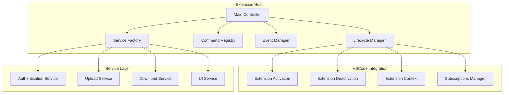

# Extension Host Component

## Overview

The Extension Host is the main controller component that manages the lifecycle of the Lighthouse VSCode extension. It serves as the central orchestrator for all extension activities, handling initialization, command registration, event management, and cleanup operations.

## Architecture

## Interface Definition

The IExtensionHost interface defines the contract for lifecycle management, service management, command handling, event management, and state management.

## Implementation

### Main Controller

The ExtensionHost class implements the main controller interface, managing the lifecycle of services, commands, and events throughout the extension's operation.

## Service Types

The ServiceType enum defines all available service types that can be registered and retrieved from the service container.

## Extension Events

The ExtensionEvent enum defines all events that can be emitted and handled throughout the extension lifecycle.

## Error Handling

The Extension Host implements comprehensive error handling:

1. **Service Initialization Errors**: Graceful degradation when services fail to initialize
2. **Command Execution Errors**: User-friendly error messages for failed operations
3. **Event Handler Errors**: Isolated error handling to prevent cascade failures
4. **Cleanup Errors**: Safe cleanup procedures during deactivation

## Testing

The ExtensionHost includes comprehensive test coverage for activation, service initialization, command registration, and command handling functionality.

## Dependencies

- **VSCode Extension API**: Core extension functionality
- **Service Factory**: Service instantiation and dependency injection
- **Configuration Service**: Extension settings management
- **Authentication Service**: User authentication
- **Upload/Download Services**: File operations
- **UI Service**: User interface management
