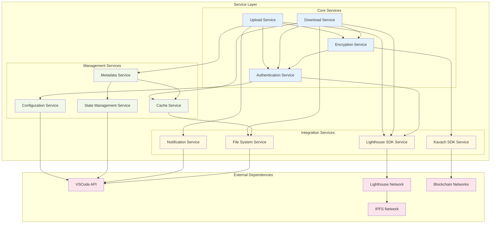
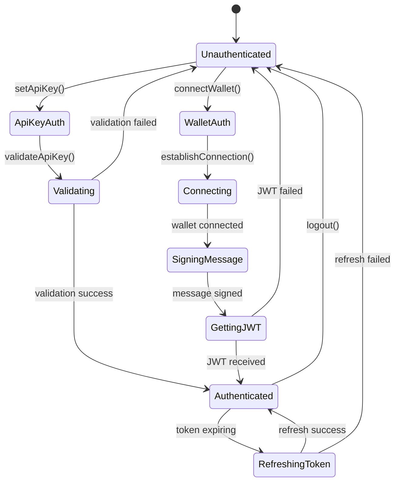
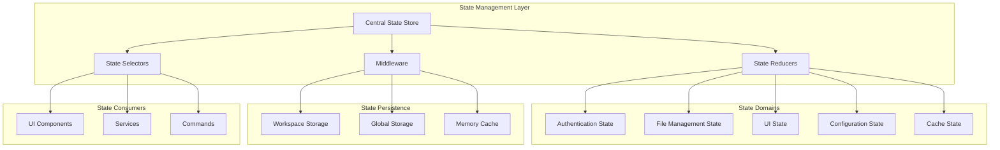

# Service Architecture Diagrams

## Service Layer Architecture



## Authentication Service Flow



## Upload Service Architecture

```mermaid
graph TB
    subgraph "Upload Service Components"
        UPLOAD_CONTROLLER[Upload Controller]
        FILE_PROCESSOR[File Processor]
        ENCRYPTION_HANDLER[Encryption Handler]
        PROGRESS_TRACKER[Progress Tracker]
        BATCH_MANAGER[Batch Manager]
    end

    subgraph "Upload Pipeline"
        VALIDATE[Validate File]
        PREPROCESS[Preprocess File]
        ENCRYPT[Encrypt (Optional)]
        CHUNK[Chunk Large Files]
        UPLOAD[Upload to IPFS]
        VERIFY[Verify Upload]
        STORE_METADATA[Store Metadata]
    end

    subgraph "External Services"
        LIGHTHOUSE_SDK[Lighthouse SDK]
        KAVACH_SDK[Kavach SDK]
        METADATA_SERVICE[Metadata Service]
        NOTIFICATION_SERVICE[Notification Service]
    end

    UPLOAD_CONTROLLER --> FILE_PROCESSOR
    UPLOAD_CONTROLLER --> ENCRYPTION_HANDLER
    UPLOAD_CONTROLLER --> PROGRESS_TRACKER
    UPLOAD_CONTROLLER --> BATCH_MANAGER

    FILE_PROCESSOR --> VALIDATE
    VALIDATE --> PREPROCESS
    PREPROCESS --> ENCRYPT
    ENCRYPT --> CHUNK
    CHUNK --> UPLOAD
    UPLOAD --> VERIFY
    VERIFY --> STORE_METADATA

    ENCRYPTION_HANDLER --> KAVACH_SDK
    FILE_PROCESSOR --> LIGHTHOUSE_SDK
    PROGRESS_TRACKER --> NOTIFICATION_SERVICE
    BATCH_MANAGER --> METADATA_SERVICE
```

## Download Service Architecture

```mermaid
graph TB
    subgraph "Download Service Components"
        DOWNLOAD_CONTROLLER[Download Controller]
        CID_RESOLVER[CID Resolver]
        DECRYPTION_HANDLER[Decryption Handler]
        STREAM_MANAGER[Stream Manager]
        CACHE_MANAGER[Cache Manager]
    end

    subgraph "Download Pipeline"
        RESOLVE_CID[Resolve CID]
        CHECK_CACHE[Check Cache]
        CHECK_ACCESS[Check Access Rights]
        FETCH_METADATA[Fetch Metadata]
        DOWNLOAD_FILE[Download File]
        DECRYPT[Decrypt (If Encrypted)]
        SAVE_LOCAL[Save to Local]
        UPDATE_CACHE[Update Cache]
    end

    subgraph "External Services"
        LIGHTHOUSE_SDK[Lighthouse SDK]
        KAVACH_SDK[Kavach SDK]
        IPFS_GATEWAY[IPFS Gateway]
        LOCAL_STORAGE[Local Storage]
    end

    DOWNLOAD_CONTROLLER --> CID_RESOLVER
    DOWNLOAD_CONTROLLER --> DECRYPTION_HANDLER
    DOWNLOAD_CONTROLLER --> STREAM_MANAGER
    DOWNLOAD_CONTROLLER --> CACHE_MANAGER

    CID_RESOLVER --> RESOLVE_CID
    RESOLVE_CID --> CHECK_CACHE
    CHECK_CACHE --> CHECK_ACCESS
    CHECK_ACCESS --> FETCH_METADATA
    FETCH_METADATA --> DOWNLOAD_FILE
    DOWNLOAD_FILE --> DECRYPT
    DECRYPT --> SAVE_LOCAL
    SAVE_LOCAL --> UPDATE_CACHE

    DECRYPTION_HANDLER --> KAVACH_SDK
    STREAM_MANAGER --> IPFS_GATEWAY
    CACHE_MANAGER --> LOCAL_STORAGE
    CID_RESOLVER --> LIGHTHOUSE_SDK
```

## State Management Architecture


