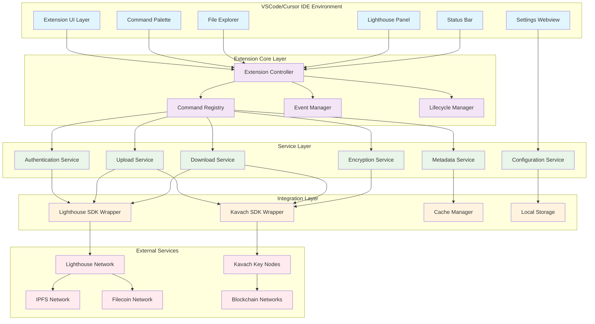
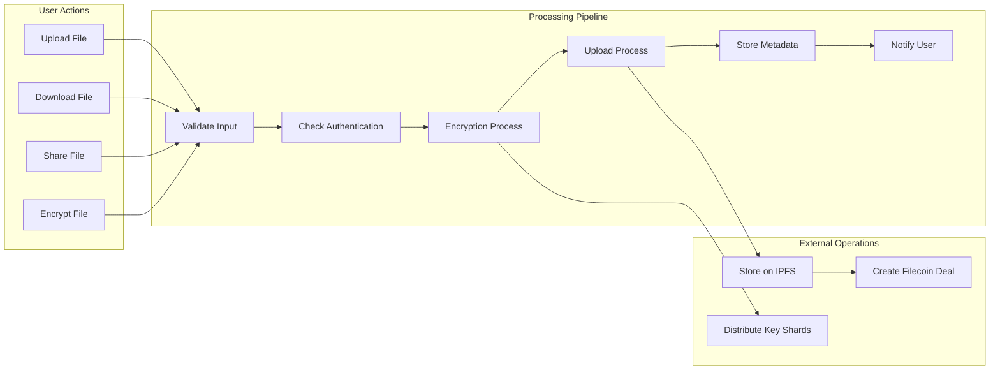
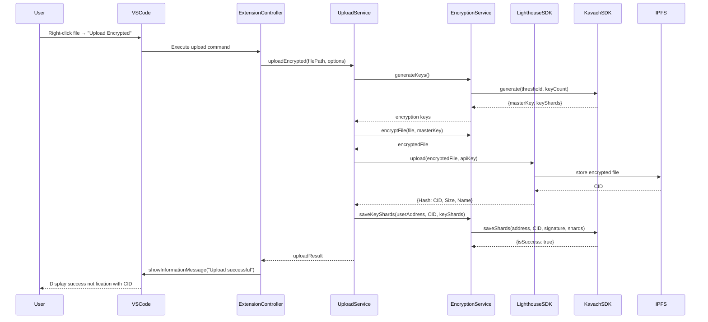

# System Architecture Diagram

## High-Level System Architecture

```mermaid
graph TB
    subgraph "VSCode/Cursor IDE Environment"
        UI[Extension UI Layer]
        CMD[Command Palette]
        EXPLORER[File Explorer]
        PANEL[Lighthouse Panel]
        STATUS[Status Bar]
        WEBVIEW[Settings Webview]
    end

    subgraph "Extension Core Layer"
        CONTROLLER[Extension Controller]
        COMMANDS[Command Registry]
        EVENTS[Event Manager]
        LIFECYCLE[Lifecycle Manager]
    end

    subgraph "Service Layer"
        AUTH[Authentication Service]
        UPLOAD[Upload Service]
        DOWNLOAD[Download Service]
        ENCRYPT[Encryption Service]
        METADATA[Metadata Service]
        CONFIG[Configuration Service]
    end

    subgraph "Integration Layer"
        LIGHTHOUSE_WRAPPER[Lighthouse SDK Wrapper]
        KAVACH_WRAPPER[Kavach SDK Wrapper]
        CACHE[Cache Manager]
        STORAGE[Local Storage]
    end

    subgraph "External Services"
        LIGHTHOUSE_API[Lighthouse Network]
        IPFS_NETWORK[IPFS Network]
        FILECOIN[Filecoin Network]
        KAVACH_NODES[Kavach Key Nodes]
        BLOCKCHAIN[Blockchain Networks]
    end

    %% UI Layer Connections
    UI --> CONTROLLER
    CMD --> CONTROLLER
    EXPLORER --> CONTROLLER
    PANEL --> CONTROLLER
    STATUS --> CONTROLLER
    WEBVIEW --> CONFIG

    %% Core Layer Connections
    CONTROLLER --> COMMANDS
    CONTROLLER --> EVENTS
    CONTROLLER --> LIFECYCLE

    %% Service Layer Connections
    COMMANDS --> AUTH
    COMMANDS --> UPLOAD
    COMMANDS --> DOWNLOAD
    COMMANDS --> ENCRYPT
    COMMANDS --> METADATA

    %% Integration Layer Connections
    AUTH --> LIGHTHOUSE_WRAPPER
    UPLOAD --> LIGHTHOUSE_WRAPPER
    UPLOAD --> KAVACH_WRAPPER
    DOWNLOAD --> LIGHTHOUSE_WRAPPER
    DOWNLOAD --> KAVACH_WRAPPER
    ENCRYPT --> KAVACH_WRAPPER
    METADATA --> CACHE
    CONFIG --> STORAGE

    %% External Service Connections
    LIGHTHOUSE_WRAPPER --> LIGHTHOUSE_API
    KAVACH_WRAPPER --> KAVACH_NODES
    LIGHTHOUSE_API --> IPFS_NETWORK
    LIGHTHOUSE_API --> FILECOIN
    KAVACH_NODES --> BLOCKCHAIN

    %% Styling
    classDef uiLayer fill:#e1f5fe
    classDef coreLayer fill:#f3e5f5
    classDef serviceLayer fill:#e8f5e8
    classDef integrationLayer fill:#fff3e0
    classDef externalLayer fill:#ffebee

    class UI,CMD,EXPLORER,PANEL,STATUS,WEBVIEW uiLayer
    class CONTROLLER,COMMANDS,EVENTS,LIFECYCLE coreLayer
    class AUTH,UPLOAD,DOWNLOAD,ENCRYPT,METADATA,CONFIG serviceLayer
    class LIGHTHOUSE_WRAPPER,KAVACH_WRAPPER,CACHE,STORAGE integrationLayer
    class LIGHTHOUSE_API,IPFS_NETWORK,FILECOIN,KAVACH_NODES,BLOCKCHAIN externalLayer
```

## Data Flow Architecture

```mermaid
graph LR
    subgraph "User Actions"
        UPLOAD_ACTION[Upload File]
        DOWNLOAD_ACTION[Download File]
        SHARE_ACTION[Share File]
        ENCRYPT_ACTION[Encrypt File]
    end

    subgraph "Processing Pipeline"
        VALIDATE[Validate Input]
        AUTH_CHECK[Check Authentication]
        ENCRYPT_PROCESS[Encryption Process]
        UPLOAD_PROCESS[Upload Process]
        METADATA_STORE[Store Metadata]
        NOTIFY[Notify User]
    end

    subgraph "External Operations"
        IPFS_STORE[Store on IPFS]
        KEY_DISTRIBUTE[Distribute Key Shards]
        FILECOIN_DEAL[Create Filecoin Deal]
    end

    UPLOAD_ACTION --> VALIDATE
    VALIDATE --> AUTH_CHECK
    AUTH_CHECK --> ENCRYPT_PROCESS
    ENCRYPT_PROCESS --> UPLOAD_PROCESS
    UPLOAD_PROCESS --> IPFS_STORE
    ENCRYPT_PROCESS --> KEY_DISTRIBUTE
    IPFS_STORE --> FILECOIN_DEAL
    UPLOAD_PROCESS --> METADATA_STORE
    METADATA_STORE --> NOTIFY

    DOWNLOAD_ACTION --> VALIDATE
    SHARE_ACTION --> VALIDATE
    ENCRYPT_ACTION --> VALIDATE
```

## Component Interaction Sequence

```mermaid
sequenceDiagram
    participant User
    participant VSCode
    participant ExtensionController
    participant UploadService
    participant EncryptionService
    participant LighthouseSDK
    participant KavachSDK
    participant IPFS

    User->>VSCode: Right-click file → "Upload Encrypted"
    VSCode->>ExtensionController: Execute upload command
    ExtensionController->>UploadService: uploadEncrypted(filePath, options)

    UploadService->>EncryptionService: generateKeys()
    EncryptionService->>KavachSDK: generate(threshold, keyCount)
    KavachSDK-->>EncryptionService: {masterKey, keyShards}
    EncryptionService-->>UploadService: encryption keys

    UploadService->>EncryptionService: encryptFile(file, masterKey)
    EncryptionService-->>UploadService: encryptedFile

    UploadService->>LighthouseSDK: upload(encryptedFile, apiKey)
    LighthouseSDK->>IPFS: store encrypted file
    IPFS-->>LighthouseSDK: CID
    LighthouseSDK-->>UploadService: {Hash: CID, Size, Name}

    UploadService->>EncryptionService: saveKeyShards(userAddress, CID, keyShards)
    EncryptionService->>KavachSDK: saveShards(address, CID, signature, shards)
    KavachSDK-->>EncryptionService: {isSuccess: true}

    UploadService-->>ExtensionController: uploadResult
    ExtensionController->>VSCode: showInformationMessage("Upload successful")
    VSCode-->>User: Display success notification with CID
```
